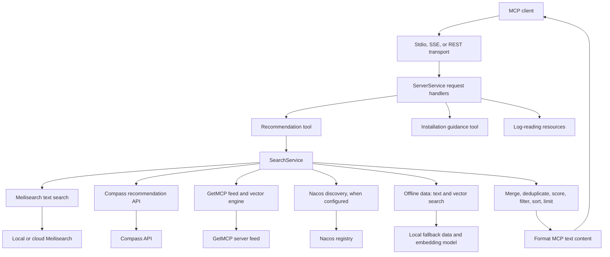
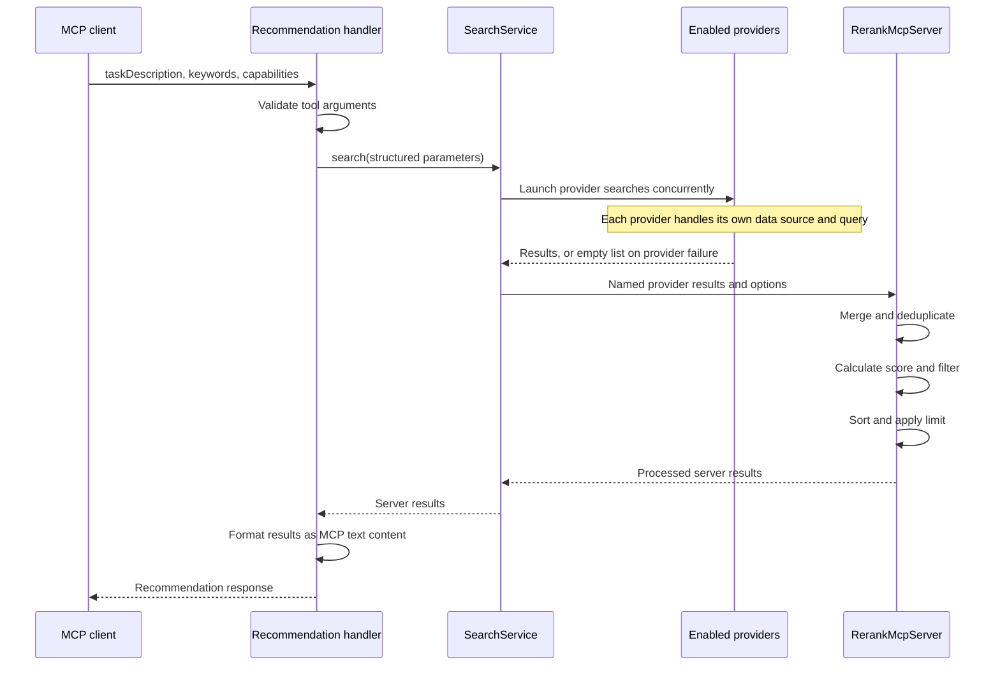
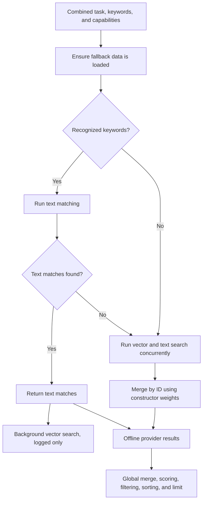

# System Architecture

[English](./ARCHITECTURE.en.md) | [简体中文](./ARCHITECTURE.md)

This guide describes MCP Advisor's architecture, core components, and data flow.
It follows the Chinese guide's topics while correcting descriptions that no
longer match the source. In particular, the active Meilisearch provider performs
text search, query-dependent weight selection is not implemented, and the
reranker does not guarantee a minimum result count. Diagrams below describe the
current implementation rather than the original proposed design. Verification
here is by source inspection, not runtime or performance testing.

## Contents

- [Architecture Overview](#architecture-overview)
- [Core Components](#core-components)
- [Data Flow](#data-flow)
- [Search Strategy](#search-strategy)
- [Technical Implementation](#technical-implementation)
- [Summary](#summary)

## Architecture Overview

MCP Advisor separates transport handling, tool handlers, search providers, result
processing, and shared utilities. The [CLI entry point](../src/index.ts)
constructs Meilisearch, Compass, and GetMCP providers. It additionally initializes
Nacos when `NACOS_SERVER_ADDR`, `NACOS_USERNAME`, and `NACOS_PASSWORD` are all set.
`SearchService` enables an offline provider by default.

### System Diagram



The search branches in the diagram are launched together. Offline search is not
only invoked after all online providers fail. A provider failure is logged and
converted to an empty result list so other providers can still contribute.

## Core Components

### 1. Search Service Layer

[SearchService](../src/services/searchService.ts) coordinates providers and
passes their named result lists to the reranker:

- **Unified interface:** Structured `SearchParams` contain `taskDescription` and
  optional `keywords` and `capabilities`.
- **Provider aggregation:** Providers execute concurrently through `Promise.all`.
- **Search options:** Defaults are `limit: 5` and `minSimilarity: 0.4`.
- **Failure isolation:** An individual provider rejection becomes an empty list.
- **Result processing:** The reranker merges and deduplicates before scoring,
  filtering, sorting, and limiting results.

The current public signatures are summarized below; this is a declaration
excerpt, not a standalone implementation:

```typescript
declare class SearchService {
  constructor(
    providers?: SearchProvider[],
    offlineConfig?: Partial<OfflineConfig>,
  );
  search(
    params: SearchParams,
    options?: SearchOptions,
  ): Promise<MCPServerResponse[]>;
}
```

Unlike the original guide's `constructor(options)` example, the first constructor
argument is a provider array. The public TypeScript search overload accepts
structured parameters, although its implementation also accepts strings at
runtime. See [the response and option types](../src/types/index.ts) and
[search parameter types](../src/types/search.ts).

### 2. Search Providers

All providers implement `search(params: SearchParams)` but use different sources
and retrieval strategies.

#### Meilisearch Provider

[MeilisearchSearchProvider](../src/services/core/search/MeilisearchSearchProvider.ts)
combines the task description, keywords, and capabilities into a text query. It
ensures feed data is loaded and then calls its client with a result limit of 10.
The client supports local/cloud configuration and failover.

The original guide describes vector/HNSW search here. That is not the active
provider query path: this provider does not send a query vector. A separate
[Meilisearch vector engine](../src/services/providers/meilisearch/vectorEngine.ts)
exists, but it should not be confused with this text-search provider.

#### GetMCP Provider

[GetMcpSearchProvider](../src/services/core/search/GetMcpSearchProvider.ts)
fetches the GetMCP server feed, caches it, indexes searchable text into its vector
engine, and searches that engine. The feed URL is configurable with
`GETMCP_API_URL`; the default is `https://getmcp.io/api/servers.json`.

This is an external feed integration, not an assertion that GetMCP is the official
MCP registry. Feed caching also means the original guide's “real-time updates”
claim is not a freshness guarantee.

#### Compass Provider

[CompassSearchProvider](../src/services/core/search/CompassSearchProvider.ts)
combines the supplied query fields and requests `/recommend?description=...`
from `COMPASS_API_BASE`. It maps the returned `github_url` to `sourceUrl` and
retains the returned score. The provider does not expose the original guide's
unspecified advanced filtering controls.

#### Nacos Provider

[NacosMcpProvider](../src/services/core/search/NacosMcpProvider.ts) integrates
service discovery. The CLI constructs it with the required credentials, awaits
`init()`, and adds it to the search provider list only after successful
initialization. An initialization failure is logged without preventing the other
providers from being used.

#### Offline Provider

[OfflineSearchProvider](../src/services/core/search/OfflineSearchProvider.ts)
uses local fallback data with an enhanced in-memory vector engine. It combines
text matching and vector search, with a text-first path for recognized keywords.

“Offline” refers to its local server-data search. Embedding-model initialization
can require a network download, and the standard CLI still constructs online
providers. It is not a network-isolation or privacy guarantee. See
[embedding utilities](../src/utils/embedding.ts).

### 3. Hybrid Search Engine

Within the offline provider:

- **Text matching:** Scores matches against local server data.
- **Vector search:** Uses the enhanced memory engine and embeddings.
- **Constructor weights:** Defaults are 0.7 for text and 0.3 for vectors.
- **Text-first path:** When recognized keywords produce text matches, those
  matches are returned while a background vector search is logged.
- **Combined path:** Otherwise text and vector searches run in parallel and their
  results are merged by ID.

The weights are configured at construction, not dynamically switched between
0.7 and 0.3 based on query classification. Provider-local recall behavior does not
guarantee a minimum number of results after the global rerank filters.

### 4. Result Processing Pipeline

[RerankMcpServer](../src/services/core/search/RerankMcpService.ts) first merges
provider results using `sourceUrl`, or `title:<title>` if no URL is present.
When a duplicate is found, higher similarity wins; equal similarity is broken by
provider priority. A supplied `minSimilarity` can filter records at this stage.

The [processor chain](../src/services/core/search/RerankMcpProcessorFactory.ts)
then applies:

1. **Score calculation:** Preserve an existing score; otherwise multiply
   similarity by provider priority (using a fallback factor of 1).
2. **Score filtering:** Compare the score, or similarity if no score exists,
   against `minScore ?? minSimilarity` when supplied.
3. **Professional rerank placeholder:** Disabled by default; no external rerank
   model is implemented in this processor.
4. **Sorting:** Default to descending score, with configured sort options.
5. **Limit:** Apply a positive result limit when specified.

This corrects the original description of priority-first sorting and adaptive
thresholds. An empty final result list remains possible.

### 5. Transport Layer

[ServerService](../src/services/core/server/ServerService.ts) supports:

- **Stdio:** Default MCP transport for local client processes.
- **SSE:** HTTP event and message endpoints.
- **REST:** The REST transport supplied by `@chatmcp/sdk`.

The server registers recommendation and installation-guidance tool handlers and
log-reading resources. The CLI reads `TRANSPORT_TYPE`, `SERVER_PORT`,
`SERVER_HOST`, and `ENDPOINT`; see the [Quick Start Guide](./GETTING_STARTED.en.md)
for current settings. HTTP health checks do not apply to stdio. Keep diagnostic
console output off the stdio protocol stream. HTTP binding is not authentication;
use localhost unless suitable network restrictions and authentication are in
place.

## Data Flow

The following sequence describes a recommendation request. It does not posit a
separate centralized keyword-extraction/vector-normalization stage: providers
receive the supplied structured fields and perform their own retrieval work.



## Search Strategy

The offline provider's two paths are shown below. The broader search service
launches this provider alongside the other configured providers.



Unlike the source guide's proposed diagram, this does not imply query-dependent
weight changes, universal HNSW indexing, adaptive global thresholds, or a
“top five” guarantee.

## Technical Implementation

### Vector Normalization

[vectorUtils.ts](../src/utils/vectorUtils.ts) implements L2 normalization and
uses it inside cosine-similarity calculation. The implementation also handles
zero or non-finite magnitudes by returning a copy:

```typescript
function normalizeVector(vector: number[]): number[] {
  const magnitude = Math.sqrt(vector.reduce((sum, val) => sum + val * val, 0));
  if (magnitude === 0 || !isFinite(magnitude)) {
    return [...vector];
  }
  return vector.map(val => val / magnitude);
}
```

This does not establish that every storage backend normalizes every vector before
storage. The source guide's universal statement is narrowed to the verified
utility behavior here.

### Hybrid Search Implementation

The offline provider's merge method uses the following operations:

1. Add vector results that have an ID, weighted by `vectorSearchWeight`.
2. Add text results that have an ID, weighted by `textMatchWeight`.
3. For an ID present in both sets, retain the maximum weighted similarity, rather
   than summing the two values.
4. Copy the resulting similarity to score, sort by similarity, and return the
   merged results to the search service for global processing.

The source guide's `textSearch` / `vectorSearch` / `mergeSearchResults` free-function
snippet is a conceptual example, not an exported API. For the actual
implementation, read
[OfflineSearchProvider.mergeResults](../src/services/core/search/OfflineSearchProvider.ts).
Default weights here are 70% text and 30% vectors, correcting the reversed weights
in that snippet.

### Provider Priority System

The current priorities from [SearchService](../src/services/searchService.ts) are:

```typescript
const PROVIDER_PRIORITIES = {
  OfflineSearchProvider: 5,
  GetMcpSearchProvider: 10,
  CompassSearchProvider: 8,
  MeilisearchSearchProvider: 9,
};
```

These keys are provider class names. Unknown provider names have priority zero at
merge time, and score calculation falls back to factor 1 when no nonzero priority
is available. Priorities influence duplicate tie-breaking and calculated scores;
existing scores are retained. They are not a separate priority-first sort as in
the Chinese guide's older sample.

## Summary

The architecture separates client transport, search orchestration, source-specific
retrieval, and result processing. Reading the provider and reranker implementations
is important when extending the system: conceptual examples in older documents
may differ from the current API or defaults.

- [Technical Reference](./TECHNICAL_REFERENCE.en.md): Details and current-source caveats
- [Quick Start Guide](./GETTING_STARTED.en.md): Installation, configuration, and use
- [Contributing Guide](../CONTRIBUTING.en.md): Development and contribution workflow
- [Troubleshooting](./TROUBLESHOOTING.en.md): Diagnosis and known documentation drift
